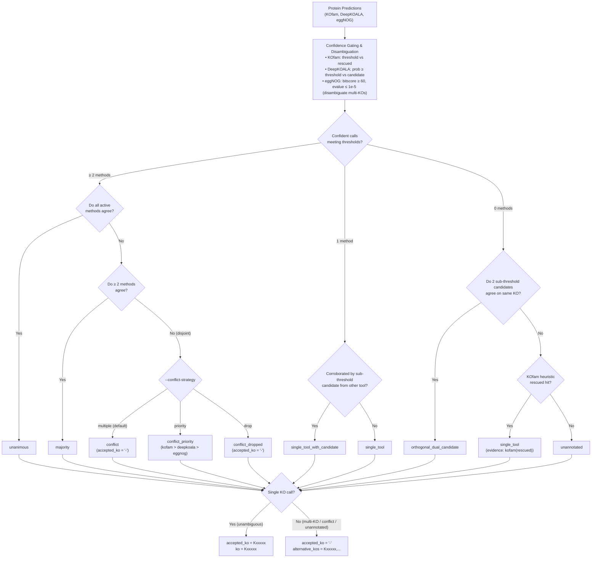

# kolach

Genome annotation targeting KEGG Orthologies (KOs).

`kolach` provides unified workflows to download databases and assign KO identifiers to protein sequences using three complementary methods:
- **KOfam**: Profile HMM searches with bitscore thresholds and heuristic rescue.
- **DeepKOALA**: Deep learning GRU models for complete or fragmented sequences.
- **eggNOG**: Orthology assignment via eggNOG orthologous groups and DIAMOND/MMseqs2.

---

## Installation

```bash
conda env create -f environment.yaml
conda activate kolach
```

---

## Usage

### 1. Download Databases

```bash
kolach download --database-dir /path/to/databases --databases kofam deepkoala eggnog
```

Optional download flags:
- `--deepkoala-release`: Model release tag (`latest` or release tag like `202608`, default: `latest`).

### 2. Annotate Proteins

```bash
kolach annotate \
    --protein-fasta proteins.faa \
    --database-dir /path/to/databases \
    --databases kofam deepkoala eggnog \
    --output-dir kolach_output \
    --threads 8
```

Key options:
- `--deepkoala-model`: `full` (complete proteins, default) or `frag` (metagenomic fragments).
- `--device`: Compute device for DeepKOALA (`auto`, `cpu`, or `cuda`).
- `--batch-size`: Batch size for DeepKOALA inference (default: `64`).
- `--eggnog-mode`: Search mode (`diamond` [default] or `mmseqs`).
- `--eggnog-sensmode`: DIAMOND sensitivity mode (default: upstream sensitive iterative search).
- `--eggnog-min-bitscore` / `--eggnog-max-evalue`: eggNOG retention thresholds (default: `60.0` / `1e-5`).
- `--eggnog-filter-multi`: Resolve multi-KO orthology groups (`disambiguate` [default], `strict`, or `none`).
- `--conflict-strategy`: Adjudication for disjoint tool calls (`multiple` [default], `priority`, or `drop`).

### 3. Standalone Table Integration

Pre-computed annotation tables can be integrated directly:

```bash
kolach integrate \
    --protein-fasta proteins.faa \
    --kofam-table kolach_output/kofam_annotations.tsv \
    --deepkoala-table kolach_output/deepkoala_annotations.tsv \
    --eggnog-table kolach_output/eggnog_annotations.tsv \
    --output-file kolach_annotations.tsv \
    --evidence-file kolach_evidence.tsv \
    --database-dir /path/to/databases
```

---

## Consensus & Integration Workflow

`kolach` integrates multi-tool predictions into `{output_dir}/kolach_annotations.tsv` (gene-level summary) and `{output_dir}/kolach_evidence.tsv` (long-form provenance) following these core principles:

1. **Confidence Gating**: Only hits passing independent thresholds count as confident votes (KOfam `threshold`, DeepKOALA `prob >= thresh`, eggNOG `bitscore >= 60` and `evalue <= 1e-5`). Sub-threshold calls are tracked as candidates.
2. **Multi-KO Disambiguation**: eggNOG multi-KO groups are resolved against confident or candidate calls from other tools (`disambiguate`).
3. **Candidate Corroboration**: Sub-threshold candidates provide supporting evidence without being counted as multi-tool confident consensus (`single_tool_with_candidate` or `orthogonal_dual_candidate`).
4. **Strict Single-KO Output**: To avoid misinterpretation by downstream metabolic reconstruction tools, `accepted_ko` strictly contains a single KO (or `-` if unannotated, multi-KO, or conflicting). Disjoint and minority calls are preserved in `alternative_kos`.
5. **Exact Definition Resolution**: Functional definitions strictly match the target KO using the master `kofam/ko_list` dictionary or matching KOfam evidence.

### Workflow Diagram



### Consensus Categories (`consensus_level`)

| Level | Description |
| :--- | :--- |
| `unanimous` | All active methods confidently agree on the KO. |
| `majority` | At least 2 active methods confidently agree on the KO. |
| `single_tool_with_candidate` | 1 confident method call corroborated by a sub-threshold candidate from another tool. |
| `orthogonal_dual_candidate` | Sub-threshold candidates from 2 independent methods agree on the same KO. |
| `single_tool` | Exactly 1 method produced a confident call (or KOfam heuristic rescue) without corroboration. |
| `conflict` | Active methods produced disjoint confident calls (`accepted_ko = '-'`, candidates in `alternative_kos`). |
| `conflict_priority` | Disjoint calls resolved by method priority hierarchy (`kofam > deepkoala > eggnog`). |
| `conflict_dropped` | Disjoint calls dropped (`accepted_ko = '-'`, all candidates in `alternative_kos`). |
| `unannotated` | No method produced a confident or corroborated KO assignment. |

---

## Output Schemas

### 1. Gene Summary Table (`kolach_annotations.tsv`)

| Column | Description |
| :--- | :--- |
| `gene_id` | Protein identifier from FASTA (preserves input order). |
| `accepted_ko` | Accepted single KEGG Orthology identifier (`-` when unannotated, conflicting, or multi-KO). |
| `ko` | Compatibility alias for `accepted_ko`. |
| `alternative_kos` | Unresolved multi-KO or conflicting candidate KOs. |
| `definition` | Official KEGG functional definition for `accepted_ko`. |
| `alternative_definition` | Functional definitions corresponding to `alternative_kos`. |
| `consensus_level` | Classification status (`unanimous`, `majority`, `single_tool`, `conflict`, etc.). |
| `evidence` | Methods and candidates supporting the assignment. |
| `kofam_ko` | Confident KO(s) assigned by KOfam (or `-`). |
| `kofam_score_type` | Applicable profile score type (`full` or `domain`). |
| `kofam_bit_score` | KOfam bit score (selected by score type). |
| `kofam_evalue` | KOfam E-value (selected by score type). |
| `kofam_assignment` | KOfam assignment type (`threshold` or `rescued`). |
| `kofam_threshold` | KOfam bit score threshold. |
| `deepkoala_ko` | Confident KO meeting DeepKOALA threshold (or `-`). |
| `deepkoala_candidate_ko` | Raw candidate KO predicted by DeepKOALA. |
| `deepkoala_score` | DeepKOALA model prediction probability. |
| `deepkoala_threshold` | DeepKOALA model confidence threshold. |
| `eggnog_ko` | Confident filtered KO(s) meeting score and E-value cutoffs (or `-`). |
| `eggnog_candidate_ko` | Raw candidate KO(s) predicted by eggNOG. |
| `eggnog_bit_score` | eggNOG alignment bit score. |
| `eggnog_evalue` | eggNOG alignment E-value. |

### 2. Evidence Table (`kolach_evidence.tsv`)

Long-form table with one row per gene $\times$ KO $\times$ method, preserving full provenance:

| Column | Description |
| :--- | :--- |
| `gene_id` | Protein identifier. |
| `ko` | Specific KEGG Orthology identifier. |
| `method` | Annotation method (`kofam`, `deepkoala`, or `eggnog`). |
| `original_status` | Pre-consensus status (`threshold_passing`, `heuristic_rescued`, `below_threshold`, `unknown`). |
| `bit_score` | Full-sequence alignment bit score. |
| `e_value` | Full-sequence alignment E-value. |
| `domain_bit_score` | Domain bit score for HMM methods. |
| `domain_e_value` | Domain E-value for HMM methods. |
| `score_type` | Threshold score type (`full`, `domain`, or `seed_hit`). |
| `threshold` | Bit score threshold for method. |
| `deepkoala_probability` | DeepKOALA prediction probability score. |
| `deepkoala_threshold` | DeepKOALA confidence threshold. |
| `shared_seed_hit` | Boolean indicating whether multi-KO metrics originate from a single seed hit. |
| `cross_method_status` | Integration outcome (`accepted`, `heuristic_rescued`, `rescued`, `disambiguated_retained`, `disambiguated_dropped`, `alternative`, `conflict`, `unresolved_multi_ko`, `below_threshold_unrescued`, `unselected`). |
| `supporting_methods` | Other methods corroborating this specific KO. |
