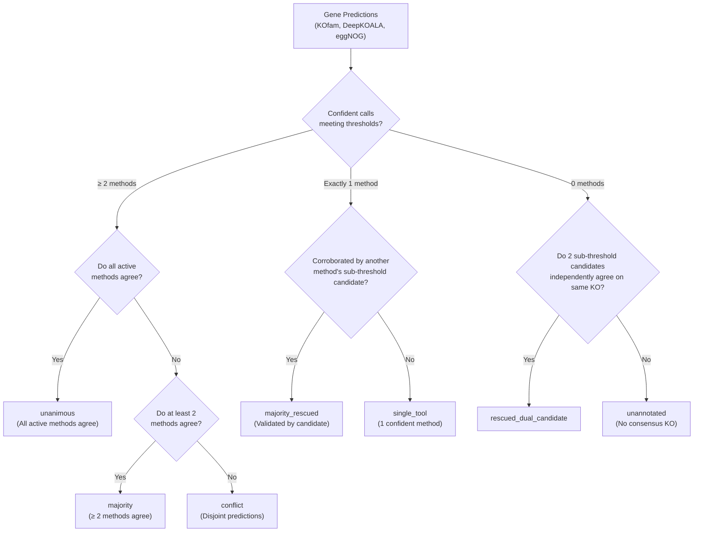

# kolach
Genome annotation targeting KEGG Orthologies (KOs).

`kolach` provides unified workflows to download databases and assign KO identifiers to protein sequences using multiple methods:
- **KOfam**: Profile HMM searches with bitscore threshold and rescue heuristics.
- **DeepKOALA**: Ultra-fast deep learning GRU models for full-length or metagenomic fragment sequences.
- **eggNOG**: Orthology assignment based on eggNOG orthologous groups.

---

## Installation

```bash
conda env create -f environment.yaml
conda activate kolach
```

---

## Usage

### 1. Download Databases

Download required databases (e.g. `kofam`, `deepkoala`, or `eggnog`) into a specified directory:

```bash
kolach download --database-dir /path/to/databases --databases deepkoala kofam
```

Optional DeepKOALA download flags:
- `--deepkoala-release`: Specify release date tag (e.g. `202608` or `latest`, default: `latest`).

### 2. Annotate Proteins

Annotate a protein FASTA file with chosen methods:

```bash
kolach annotate \
    --protein-fasta proteins.faa \
    --database-dir /path/to/databases \
    --databases deepkoala kofam eggnog \
    --output-dir kolach_output \
    --threads 8
```

DeepKOALA-specific options:
- `--deepkoala-model`: Model variant to use (`full` for complete sequences, `frag` for metagenomic fragments; default: `full`).
- `--deepkoala-release`: Model release tag to use (default: `latest`).
- `--device`: Compute device (`auto`, `cpu`, or `cuda`; default: `auto`).
- `--batch-size`: Batch size for inference (default: `64`).
- `--detail`: Emit detailed probabilities, thresholds, and boundary marks.

eggNOG-specific options:
- `--eggnog-mode`: Search mode (`diamond` or `mmseqs`, default: `diamond`).
- `--eggnog-sensmode`: Diamond sensitivity mode (`default`, `fast`, `mid-sensitive`, `sensitive`, `more-sensitive`, `very-sensitive`, `ultra-sensitive`). When left unspecified, eggNOG-mapper's default sensitivity (sensitive, iterative search) is used. Selecting `default` explicitly requests DIAMOND's default (faster, non-sensitive) sensitivity mode. Note: faster sensitivity settings reduce runtime but can lower distant-homolog and KO recovery rates.
- `--eggnog-temp-dir`: Path to base directory for eggNOG temporary files and DIAMOND scratch files (`emappertmp_dmdn_*`). Defaults to the system temporary directory.
- `--eggnog-dmnd-block-size`: DIAMOND block size in billions of sequence letters (`--dmnd_block_size`). When unspecified, DIAMOND automatically tunes this based on host RAM. In HPC/Slurm jobs with constrained cgroup memory limits, automatic host-RAM tuning may exceed job memory allocations, leading to OOM termination; setting this parameter controls memory usage.
- `--eggnog-dmnd-index-chunks`: Number of chunks for processing the DIAMOND seed index (`--dmnd_index_chunks`). When unspecified, upstream automatic tuning is used.

---

## Integration & Consensus Workflow

When multiple methods are run with `kolach annotate`, or when using the standalone `kolach integrate` command, `kolach` integrates the individual outputs into `{output_dir}/kolach_annotations.tsv` using **pandas**.

The integration pipeline resolves consensus, disambiguates ambiguous calls, rescues sub-threshold evidence, and retains all numerical metrics (bit scores, E-values, probabilities, and thresholds) throughout the output table.

### Key Integration Mechanics

#### 1. Confidence Gating & Candidate Retention
- **DeepKOALA**: In detailed mode (`--detail`), DeepKOALA outputs the top candidate KO for every sequence. `kolach` only promotes a prediction to `deepkoala_ko` if it satisfies the model's confidence threshold (`probability >= threshold`, marked with `*`). The raw prediction is permanently preserved in `deepkoala_candidate_ko` along with `deepkoala_score` (probability) and `deepkoala_threshold`.
- **eggNOG**: eggNOG hits with bitscore $\ge$ `--eggnog-min-bitscore` (default: `60.0`) are retained in `eggnog_ko`. The raw predicted orthology assignment is permanently preserved in `eggnog_candidate_ko` along with `eggnog_bit_score` and `eggnog_evalue`.

#### 2. eggNOG Multi-KO Disambiguation
eggNOG orthologous groups often map to multiple candidate KOs (e.g. `K00010,K00020`). Controlled by `--eggnog-filter-multi`:
- `disambiguate` *(default)*: Uses overlapping calls from KOfam or DeepKOALA to resolve the multi-KO to the specific agreed KO. If no other tool made a call, candidate KOs are kept to avoid losing coverage.
- `strict`: Requires corroboration by KOfam or DeepKOALA; unresolved multi-KOs are dropped.
- `none`: Keeps eggNOG multi-KOs as-is without filtering.

#### 3. Cross-Method Candidate Rescue
Below-threshold candidate predictions are rescued when independently corroborated by orthogonal evidence:
- **`majority_rescued`**: If a method makes a confident call (e.g. KOfam calls `K01234`), and another method produced `K01234` as a candidate (even if its probability was below cutoff), the candidate validates the call. Evidence is recorded as `kofam,deepkoala(candidate)`.
- **`rescued_dual_candidate`**: If two independent methods both produced sub-threshold candidate calls, but **independently agree on the exact same KO**, the orthogonal agreement between the neural network and sequence alignment rescues the call.

#### 4. Conflict Adjudication
When active methods produce disjoint predictions with zero KO overlap:
- `multiple` *(default)*: Labeled as `consensus_level = conflict`. **All candidate KOs** are listed comma-separated in the `ko` column (e.g. `K00004,K00005`), and their functional descriptions are joined with semicolons in `definition`.
- `priority`: Resolves the conflict using curated HMM hierarchy (`kofam > deepkoala > eggnog`), labeled `conflict_priority`.
- `drop`: Discards the conflicting call (`ko = -`), labeled `conflict_dropped`.

#### 5. Functional Definition Resolution
The `definition` column is populated using a multi-tier lookup:
1. **Master Dictionary (`ko_list`)**: If `--database-dir` is provided, `kolach` queries the master `kofam/ko_list` table containing official definitions and EC numbers for all ~28,388 KEGG Orthologies. This works even for KOs called solely by DeepKOALA.
2. **KOfam Table**: Falls back to the `definition` column from `kofam_annotations.tsv`.
3. **eggNOG Table**: Falls back to the `Description` column from `eggnog_annotations.tsv`.

---

### Consensus Categories (`consensus_level`)



| Level | Description |
| :--- | :--- |
| `unanimous` | All active methods agree on the assigned KO(s). |
| `majority` | At least 2 methods confidently agree on the assigned KO(s). |
| `majority_rescued` | 1 confident method call corroborated by a sub-threshold candidate from another method. |
| `rescued_dual_candidate` | Sub-threshold candidates from 2 methods independently agree on the exact same KO. |
| `single_tool` | Exactly 1 method produced a confident call with no disagreement from others. |
| `conflict` | Active methods produced disjoint calls with zero overlap (all KOs listed in `ko`). |
| `unannotated` | No method produced a confident or corroborated KO assignment. |

---

### Standalone Table Integration Command

Pre-computed annotation tables can be integrated directly:

```bash
kolach integrate \
    --protein-fasta proteins.faa \
    --kofam-table kolach_output/kofam_annotations.tsv \
    --deepkoala-table kolach_output/deepkoala_annotations.tsv \
    --eggnog-table kolach_output/eggnog_annotations.tsv \
    --output-file kolach_annotations.tsv \
    --database-dir /path/to/databases \
    --eggnog-min-bitscore 60.0 \
    --eggnog-filter-multi disambiguate \
    --conflict-strategy multiple
```

### Integrated Output Schema (`kolach_annotations.tsv`)

| Column | Description |
| :--- | :--- |
| `gene_id` | Protein identifier from FASTA (preserves original sequence order) |
| `ko` | Final integrated / consensus KO identifier(s) (comma-separated if multi-domain/conflict) |
| `definition` | Official KEGG functional definition and EC numbers |
| `consensus_level` | Classification status (`unanimous`, `majority`, `single_tool`, `conflict`, etc.) |
| `evidence` | Specific methods supporting the final KO assignment |
| `kofam_ko` | Confident KO(s) assigned by KOfam (or `-`) |
| `kofam_bit_score` | KOfam bit score |
| `kofam_evalue` | KOfam E-value |
| `kofam_assignment` | KOfam assignment type (`threshold` or `rescued`) |
| `kofam_threshold` | KOfam bitscore threshold |
| `deepkoala_ko` | Confident KO(s) meeting DeepKOALA confidence cutoff (or `-`) |
| `deepkoala_candidate_ko` | Raw candidate KO predicted by DeepKOALA regardless of threshold |
| `deepkoala_score` | DeepKOALA model probability score |
| `deepkoala_threshold` | DeepKOALA model confidence threshold |
| `eggnog_ko` | Confident filtered KO(s) assigned by eggNOG (or `-`) |
| `eggnog_candidate_ko` | Raw candidate KO(s) predicted by eggNOG regardless of bitscore |
| `eggnog_bit_score` | eggNOG Diamond bit score |
| `eggnog_evalue` | eggNOG Diamond E-value |
