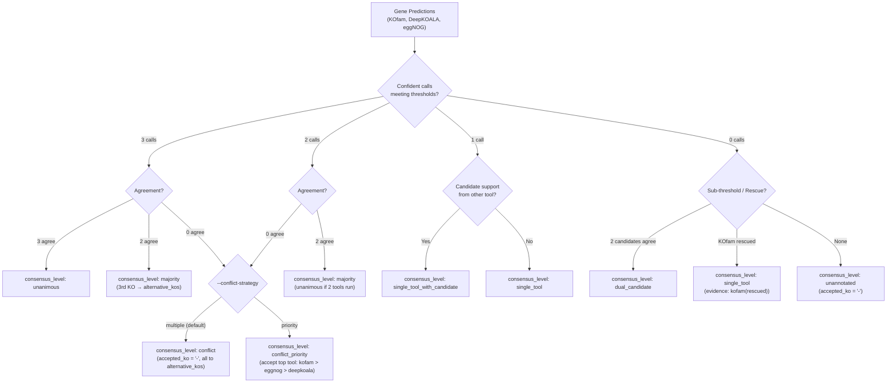

# kolach

Genome annotation targeting KEGG Orthologies (KOs).

`kolach` provides unified workflows to download databases and assign KO identifiers to protein sequences using three complementary methods:
- **KOfam**: Profile HMM searches with bitscore thresholds and heuristic rescue.
- **DeepKOALA**: Deep learning GRU models for complete or fragmented sequences.
- **eggNOG**: Orthology assignment via eggNOG orthologous groups and DIAMOND/MMseqs2.

---

## Installation

```bash
conda env create -f environment.yaml
conda activate kolach
```

---

## Usage

### 1. Download Databases

```bash
kolach download --database-dir /path/to/databases --databases kofam deepkoala eggnog
```

Optional download flags:
- `--deepkoala-release`: Model release tag (`latest` or release tag like `202608`, default: `latest`).

### 2. Annotate Proteins

```bash
kolach annotate \
    --protein-fasta proteins.faa \
    --database-dir /path/to/databases \
    --databases kofam deepkoala eggnog \
    --output-dir kolach_output \
    --threads 8
```

Key options:
- `--deepkoala-model`: `full` (complete proteins, default) or `frag` (metagenomic fragments).
- `--device`: Compute device for DeepKOALA (`auto`, `cpu`, or `cuda`).
- `--batch-size`: Batch size for DeepKOALA inference (default: `64`).
- `--eggnog-mode`: Search mode (`diamond` [default] or `mmseqs`).
- `--eggnog-sensmode`: DIAMOND sensitivity mode (default: upstream sensitive iterative search).
- `--eggnog-min-bitscore` / `--eggnog-max-evalue`: eggNOG retention thresholds (default: `60.0` / `1e-5`).
- `--eggnog-filter-multi`: Resolve multi-KO orthology groups (`disambiguate` [default] or `none`).
- `--conflict-strategy`: Adjudication for disjoint tool calls (`multiple` [default] or `priority`).
- `--skip-bitscore-heuristic`: Disable the KOfam sub-threshold rescue heuristic.
- `--heuristic-bitscore-fraction`: Fraction of the KOfam profile threshold used to rescue below-threshold hits (default: `0.75`).
- `--heuristic-e-value`: Maximum E-value for KOfam hit rescue consideration (default: `1e-5`).

### 3. Standalone Table Integration

Pre-computed annotation tables can be integrated directly:

```bash
kolach integrate \
    --protein-fasta proteins.faa \
    --kofam-table kolach_output/kofam_annotations.tsv \
    --deepkoala-table kolach_output/deepkoala_annotations.tsv \
    --eggnog-table kolach_output/eggnog_annotations.tsv \
    --output-file kolach_annotations.tsv \
    --evidence-file kolach_evidence.tsv \
    --database-dir /path/to/databases
```

---

## Consensus & Integration Workflow

`kolach` reconciles multi-tool outputs into `{output_dir}/kolach_annotations.tsv` (gene-level summary) and `{output_dir}/kolach_evidence.tsv` (long-form provenance).

### Integration Logic

1. **Confidence Gating & Disambiguation**: Hits must meet method thresholds to count as confident votes (KOfam bit score $\ge$ profile threshold, DeepKOALA probability $\ge$ threshold, eggNOG bit score $\ge$ 60 and E-value $\le$ 1e-5). Sub-threshold predictions are tracked as candidates. Each eggNOG multi-KO seed group is disambiguated independently; singleton and overlapping-group support is preserved.
2. **Consensus by Confident Call Count (3, 2, 1, 0)**:
   - **3 Confident Calls**: All 3 agree $\rightarrow$ `unanimous`. Exactly 2 agree $\rightarrow$ `majority` (the 3rd unselected call is preserved in `alternative_kos`). All 3 differ $\rightarrow$ disjoint conflict.
   - **2 Confident Calls**: Both agree $\rightarrow$ `majority` (or `unanimous` if only 2 tools were run). Disagree $\rightarrow$ disjoint conflict.
   - **1 Confident Call**: Supported by another tool's sub-threshold candidate $\rightarrow$ `single_tool_with_candidate`; sole call $\rightarrow$ `single_tool`.
   - **0 Confident Calls**: 2 independent sub-threshold candidates agree $\rightarrow$ `dual_candidate`. KOfam heuristic rescue $\rightarrow$ `single_tool` (`evidence = kofam(rescued)`). Otherwise $\rightarrow$ `unannotated`.
3. **Conflict Resolution (`--conflict-strategy`)**:
   - `multiple` *(default)*: Assigns `consensus_level = conflict`, sets `accepted_ko = '-'`, and records all conflicting KOs in `alternative_kos`.
   - `priority`: Assigns `consensus_level = conflict_priority`, selecting the top tool's KO (`kofam > eggnog > deepkoala`) for `accepted_ko` and moving unselected KOs to `alternative_kos`.
4. **Strict Single-KO Policy**: Downstream pathway tools require single-KO calls. `accepted_ko` strictly contains exactly one KO (or `-` if unannotated, multi-KO, or conflicting). Confident minority/dropped calls and corroborated but unresolved candidates are retained in `alternative_kos`; uncorroborated sub-threshold candidates are not.

> **Tied majority**: When multiple KOs each have majority support but no single KO is agreed on by a dominant set of tools (e.g. kofam calls {K1, K2}, deepkoala calls {K2}, eggNOG calls {K1}, so K1 and K2 each have 2 of 3 votes), the gene is still classified `majority`, but `accepted_ko = '-'` and every tied KO is routed to `alternative_kos` under the strict single-KO policy.

### Workflow Diagram



### Consensus Categories (`consensus_level`)

| Level | Description | Output Routing |
| :--- | :--- | :--- |
| `unanimous` | All active methods confidently share support for one or more KOs. | Single shared KO is accepted; multiple shared KOs remain alternatives. |
| `majority` | At least 2 methods confidently share support for one or more KOs. | Single agreed KO is accepted; tied KOs remain alternatives. |
| `single_tool_with_candidate` | 1 confident call set corroborated by another tool's candidate. | Single confident KO is accepted; ambiguous confident KOs remain alternatives. |
| `single_tool` | Exactly 1 confident method (or KOfam rescue) without corroboration. | Single KO is accepted; ambiguous KOs remain alternatives. |
| `dual_candidate` | Sub-threshold candidates from at least 2 methods agree. | Single agreed KO is accepted; multiple corroborated KOs remain alternatives. |
| `conflict` | Disjoint calls under `multiple` (default). | `accepted_ko` = `-` (`alternative_kos` = all conflicting KOs) |
| `conflict_priority` | Disjoint calls evaluated by method hierarchy. | A single top-tool KO is accepted; an ambiguous top-tool set remains unresolved in alternatives. |
| `unannotated` | No method produced a confident or corroborated assignment. | `accepted_ko` = `-` (`alternative_kos` = `-`) |

---

## Output Schemas

### 1. Gene Summary Table (`kolach_annotations.tsv`)

| Column | Description |
| :--- | :--- |
| `gene_id` | Protein identifier from FASTA (preserves input order). |
| `accepted_ko` | Accepted single KEGG Orthology identifier (`-` when unannotated, conflicting, or multi-KO). |
| `alternative_kos` | Unresolved confident calls, disambiguated eggNOG KOs, or corroborated candidate KOs. |
| `definition` | Official KEGG functional definition for `accepted_ko`. |
| `alternative_definition` | Functional definitions corresponding to `alternative_kos`. |
| `consensus_level` | Classification status (`unanimous`, `majority`, `single_tool`, `conflict`, etc.). |
| `evidence` | Methods and candidates supporting the assignment. |
| `kofam_ko` | Confident KO(s) assigned by KOfam (or `-`). |
| `kofam_score_type` | Applicable profile score type (`full` or `domain`). |
| `kofam_bit_score` | KOfam bit score (selected by score type); multi-KO rows use comma-separated `KO:value` pairs. |
| `kofam_evalue` | KOfam E-value (selected by score type); multi-KO rows use comma-separated `KO:value` pairs. |
| `kofam_assignment` | KOfam assignment type (`threshold` or `rescued`). |
| `kofam_threshold` | KOfam bit score threshold; multi-KO rows use comma-separated `KO:value` pairs. |
| `deepkoala_ko` | Confident KO meeting DeepKOALA threshold (or `-`). |
| `deepkoala_candidate_ko` | Raw candidate KO predicted by DeepKOALA. |
| `deepkoala_score` | DeepKOALA probability; multi-KO rows use comma-separated `KO:value` pairs. |
| `deepkoala_threshold` | DeepKOALA threshold; multi-KO rows use comma-separated `KO:value` pairs. |
| `eggnog_ko` | Confident filtered KO(s) meeting score and E-value cutoffs (or `-`). |
| `eggnog_candidate_ko` | Raw candidate KO(s) predicted by eggNOG. |
| `eggnog_bit_score` | eggNOG bit score; multi-KO rows use comma-separated `KO:value` pairs. |
| `eggnog_evalue` | eggNOG E-value; multi-KO rows use comma-separated `KO:value` pairs. |

Values in multi-KO `KO:value` metric fields use six significant digits; unavailable values are written as `-`.

### 2. Evidence Table (`kolach_evidence.tsv`)

Long-form table with one row per gene $\times$ KO $\times$ method, preserving full provenance:

| Column | Description |
| :--- | :--- |
| `gene_id` | Protein identifier. |
| `ko` | Specific KEGG Orthology identifier. |
| `method` | Annotation method (`kofam`, `deepkoala`, or `eggnog`). |
| `bit_score` | Full-sequence alignment bit score. |
| `e_value` | Full-sequence alignment E-value. |
| `domain_bit_score` | Domain bit score for HMM methods. |
| `domain_e_value` | Domain E-value for HMM methods. |
| `score_type` | Threshold score type (`full`, `domain`, or `seed_hit`). |
| `bit_score_threshold` | Bit score cutoff for method (`0.75 * threshold` for rescued KOfam, profile cutoff for primary KOfam, min bitscore for eggNOG, `-` for DeepKOALA). |
| `e_value_threshold` | E-value cutoff for method (`1e-5` for rescued KOfam and eggNOG, `-` for primary KOfam and DeepKOALA). |
| `deepkoala_probability` | DeepKOALA prediction probability score. |
| `deepkoala_threshold` | DeepKOALA confidence threshold. |
| `eggnog_shared_seed_hit` | Boolean indicating whether eggNOG alignment metrics are shared across multiple candidate KOs (`True` for multi-KO eggNOG rows, `False` otherwise). |
| `original_status` | Pre-consensus status (`threshold_passing`, `heuristic_rescued`, `below_threshold`, `unknown`). |
| `cross_method_status` | Per-hit outcome (`accepted`, `heuristic_rescued`, `rescued`, `disambiguated_retained`, `disambiguated_dropped`, `alternative`, `conflict`, `unresolved_multi_ko`, `below_threshold_unrescued`, `unselected`). `rescued` is a corroborated below-threshold KO retained as accepted or alternative; `unselected` covers threshold-passing or heuristic-rescued hits not selected in consensus. |
| `consensus_level` | Gene-level support pattern (`unanimous`, `majority`, `single_tool`, etc.); it does not by itself guarantee a unique `accepted_ko`. |
| `supporting_methods` | Other methods corroborating this specific KO. |
