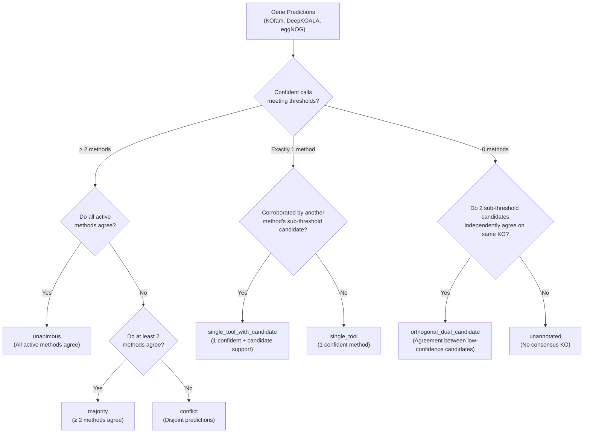

# kolach
Genome annotation targeting KEGG Orthologies (KOs).

`kolach` provides unified workflows to download databases and assign KO identifiers to protein sequences using multiple methods:
- **KOfam**: Profile HMM searches with bitscore threshold and rescue heuristics.
- **DeepKOALA**: Ultra-fast deep learning GRU models for full-length or metagenomic fragment sequences.
- **eggNOG**: Orthology assignment based on eggNOG orthologous groups.

---

## Installation

```bash
conda env create -f environment.yaml
conda activate kolach
```

---

## Usage

### 1. Download Databases

Download required databases (e.g. `kofam`, `deepkoala`, or `eggnog`) into a specified directory:

```bash
kolach download --database-dir /path/to/databases --databases deepkoala kofam
```

Optional DeepKOALA download flags:
- `--deepkoala-release`: Specify release date tag (e.g. `202608` or `latest`, default: `latest`).

### 2. Annotate Proteins

Annotate a protein FASTA file with chosen methods:

```bash
kolach annotate \
    --protein-fasta proteins.faa \
    --database-dir /path/to/databases \
    --databases deepkoala kofam eggnog \
    --output-dir kolach_output \
    --threads 8
```

DeepKOALA-specific options:
- `--deepkoala-model`: Model variant to use (`full` for complete sequences, `frag` for metagenomic fragments; default: `full`).
- `--deepkoala-release`: Model release tag to use (default: `latest`).
- `--device`: Compute device (`auto`, `cpu`, or `cuda`; default: `auto`).
- `--batch-size`: Batch size for inference (default: `64`).
- `--detail`: Emit detailed probabilities, thresholds, and boundary marks.

eggNOG-specific options:
- `--eggnog-mode`: Search mode (`diamond` or `mmseqs`, default: `diamond`).
- `--eggnog-sensmode`: Diamond sensitivity mode (`default`, `fast`, `mid-sensitive`, `sensitive`, `more-sensitive`, `very-sensitive`, `ultra-sensitive`). When left unspecified, eggNOG-mapper's default sensitivity (sensitive, iterative search) is used. Selecting `default` explicitly requests DIAMOND's default (faster, non-sensitive) sensitivity mode. Note: faster sensitivity settings reduce runtime but can lower distant-homolog and KO recovery rates.
- `--eggnog-temp-dir`: Path to base directory for eggNOG temporary files and DIAMOND scratch files (`emappertmp_dmdn_*`). Defaults to the system temporary directory.
- `--eggnog-dmnd-block-size`: DIAMOND block size in billions of sequence letters (`--dmnd_block_size`). When unspecified, DIAMOND automatically tunes this based on host RAM. In HPC/Slurm jobs with constrained cgroup memory limits, automatic host-RAM tuning may exceed job memory allocations, leading to OOM termination; setting this parameter controls memory usage.
- `--eggnog-dmnd-index-chunks`: Number of chunks for processing the DIAMOND seed index (`--dmnd_index_chunks`). When unspecified, upstream automatic tuning is used.

---

## Integration & Consensus Workflow

When multiple methods are run with `kolach annotate`, or when using the standalone `kolach integrate` command, `kolach` integrates the individual outputs into `{output_dir}/kolach_annotations.tsv` and `{output_dir}/kolach_evidence.tsv` using **pandas**.

The integration pipeline resolves consensus, disambiguates ambiguous calls, tracks candidate evidence, and retains all numerical metrics (bit scores, E-values, probabilities, and thresholds) and provenance throughout the output tables.

### Key Integration Mechanics

#### 1. Confidence Gating & Candidate Retention
- **KOfam**: Hits meeting profile bitscore thresholds have assignment `threshold` (`threshold_passing`). Hits rescued by KOfam's internal bitscore relaxation heuristic have assignment `rescued` (`heuristic_rescued`). `kolach` preserves this distinction and does not silently count heuristic rescues as threshold-passing evidence.
- **DeepKOALA**: In detailed mode (`--detail`), DeepKOALA outputs the top candidate KO for every sequence. `kolach` only promotes a prediction to `deepkoala_ko` if it satisfies the model's confidence threshold (`probability >= threshold`, marked with `*`). The raw prediction is permanently preserved in `deepkoala_candidate_ko` along with `deepkoala_score` (probability) and `deepkoala_threshold`.
- **eggNOG**: eggNOG hits with bitscore $\ge$ `--eggnog-min-bitscore` (default: `60.0`) and E-value $\le$ `--eggnog-max-evalue` (default: `1e-5`) are retained in `eggnog_ko`. Below-threshold hits are never promoted to confident calls even when corroborated by other tools; their predictions are preserved in `eggnog_candidate_ko` along with `eggnog_bit_score` and `eggnog_evalue`.

#### 2. eggNOG Multi-KO Disambiguation
eggNOG orthologous groups often map to multiple candidate KOs (e.g. `K00010,K00020`). All KOs derived from the same seed alignment share seed-hit metrics (`shared_seed_hit = True`). Multi-KO filtering is controlled by `--eggnog-filter-multi`:
- `disambiguate` *(default)*: Uses overlapping confident calls from KOfam or DeepKOALA to resolve the multi-KO to the specific agreed KO. If no other tool made a confident call, candidates are compared to avoid losing coverage. The original candidate set is preserved in `eggnog_candidate_ko` and the evidence table.
- `strict`: Requires corroboration by KOfam or DeepKOALA; unresolved multi-KOs are dropped.
- `none`: Keeps eggNOG multi-KOs as-is without filtering.

#### 3. Cross-Method Candidate Corroboration
Sub-threshold candidate predictions provide corroborating evidence without being counted as independent confident votes:
- **`single_tool_with_candidate`**: Exactly 1 method produced an independently confident (threshold-passing) call, and another active method produced a matching sub-threshold candidate (e.g. KOfam calls `K01234`, and eggNOG or DeepKOALA produced `K01234` below cutoff). Evidence is recorded as `kofam,eggnog(candidate)` or `kofam,deepkoala(candidate)`. This remains distinguished from true multi-method agreement and is never labeled `majority` or `unanimous`.
- **`orthogonal_dual_candidate`**: When no method made a confident call, but sub-threshold candidates from two independent methods agree on the exact same KO (e.g. DeepKOALA neural model and eggNOG alignment both hypothesize `K01234`), this agreement is captured as a low-confidence candidate assignment (`evidence = deepkoala(candidate),eggnog(candidate)`). Cross-method agreement is not treated as experimental validation or assumed to have statistically independent errors.

#### 4. Conflict Adjudication & Separation of Accepted KOs
To protect downstream metabolic pathway reconstruction and completeness tools (e.g. MinPath, DRAM, KEGGDecoder) from failing or misinterpreting comma-separated strings as multifunctional enzymes, **`accepted_ko` strictly contains single hits only**:
- When a single KO is accepted (e.g. unanimous/majority/single_tool consensus on 1 KO): `accepted_ko` contains that single KO, and `ko` mirrors `accepted_ko`. If other tools disambiguated an eggNOG multi-KO hit down to that single KO, the other candidate hits eggNOG proposed are preserved in **`alternative_kos`** (e.g. `K00375`) with their definitions in `alternative_definition`. If no sibling candidates were dropped, `alternative_kos` is `-`.
- When multiple KO predictions exist without cross-tool overlap (e.g. unresolved multi-KO hits from an eggNOG orthology group or multidomain KOfam call): `accepted_ko` and `ko` are set to `-`, while the candidate KOs are placed in **`alternative_kos`** (e.g. `K01447,K01448`), and their definitions are placed in `alternative_definition`.
- When active methods produce disjoint predictions with zero KO overlap:
  - `multiple` *(default)*: Labeled as `consensus_level = conflict`. **`accepted_ko` is set to `-`** (and `ko` is set to `-`), while conflicting alternatives are listed in **`alternative_kos`** (e.g. `K00004,K00005,K00006`). Functional definitions for accepted KOs are set to `-`, while alternative definitions are recorded in `alternative_definition`.
  - `priority`: Resolves the conflict using curated hierarchy (`kofam > deepkoala > eggnog`), labeled `conflict_priority`. If the priority method called a single KO, `accepted_ko` contains the selected KO and `alternative_kos` contains the unselected conflicting KO(s). If the priority method called multiple KOs, all candidates remain in `alternative_kos` and `accepted_ko = -`.
  - `drop`: Discards the conflicting call (`accepted_ko = -`, `ko = -`), retaining conflicting alternatives in `alternative_kos` for auditability, labeled `conflict_dropped`.

#### 5. Functional Definition Resolution
The `definition` column is populated using a multi-tier lookup:
1. **Master Dictionary (`ko_list`)**: If `--database-dir` is provided, `kolach` queries the master `kofam/ko_list` table containing official definitions and EC numbers for all ~28,388 KEGG Orthologies. This works even for KOs called solely by DeepKOALA.
2. **KOfam Table**: Falls back to the `definition` column from `kofam_annotations.tsv`.
3. **eggNOG Table**: Falls back to the `Description` column from `eggnog_annotations.tsv`.

---

### Consensus Categories (`consensus_level`)



| Level | Description |
| :--- | :--- |
| `unanimous` | All active methods confidently agree on the assigned KO(s). |
| `majority` | At least 2 methods confidently agree on the assigned KO(s). |
| `single_tool_with_candidate` | Exactly 1 confident method call corroborated by a sub-threshold candidate from another method. |
| `orthogonal_dual_candidate` | Sub-threshold candidates from 2 methods independently agree on the exact same KO. |
| `single_tool` | Exactly 1 method produced a confident call with no candidate corroboration from others. |
| `conflict` | Active methods produced disjoint confident calls with zero overlap (`accepted_ko = -`, candidates in `alternative_kos`). |
| `conflict_priority` | Disjoint calls resolved by method priority hierarchy (`accepted_ko` selected if single KO, remainder in `alternative_kos`). |
| `conflict_dropped` | Disjoint calls dropped (`accepted_ko = -`, all conflicting KOs in `alternative_kos`). |
| `unannotated` | No method produced a confident or corroborated KO assignment. |

---

### Standalone Table Integration Command

Pre-computed annotation tables can be integrated directly:

```bash
kolach integrate \
    --protein-fasta proteins.faa \
    --kofam-table kolach_output/kofam_annotations.tsv \
    --deepkoala-table kolach_output/deepkoala_annotations.tsv \
    --eggnog-table kolach_output/eggnog_annotations.tsv \
    --output-file kolach_annotations.tsv \
    --evidence-file kolach_evidence.tsv \
    --database-dir /path/to/databases \
    --eggnog-min-bitscore 60.0 \
    --eggnog-max-evalue 1e-5 \
    --eggnog-filter-multi disambiguate \
    --conflict-strategy multiple
```

---

### Output Schemas

#### 1. Gene-Level Summary Table (`kolach_annotations.tsv`)

| Column | Description |
| :--- | :--- |
| `gene_id` | Protein identifier from FASTA (preserves original sequence order) |
| `accepted_ko` | Accepted single KEGG Orthology identifier (`-` when unannotated, conflicting, or multiple KOs) |
| `ko` | Compatibility alias of `accepted_ko` (strictly single KO, evaluates to `-` when conflicting or multiple KOs) |
| `alternative_kos` | Unresolved conflicting or multi-KO candidate KOs (`-` when single accepted KO or unannotated) |
| `definition` | Official KEGG functional definition corresponding to `accepted_ko` |
| `alternative_definition` | Functional definitions corresponding to `alternative_kos` |
| `consensus_level` | Classification status (`unanimous`, `majority`, `single_tool_with_candidate`, `conflict`, etc.) |
| `evidence` | Specific methods and candidates supporting the assignment |
| `kofam_ko` | Confident KO(s) assigned by KOfam (or `-`) |
| `kofam_bit_score` | KOfam bit score (per-KO scores for multi-KO hits) |
| `kofam_evalue` | KOfam E-value (per-KO E-values for multi-KO hits) |
| `kofam_assignment` | KOfam assignment type (`threshold`, `rescued`, or per-KO status) |
| `kofam_threshold` | KOfam bitscore threshold |
| `deepkoala_ko` | Confident KO(s) meeting DeepKOALA confidence cutoff (or `-`) |
| `deepkoala_candidate_ko` | Raw candidate KO predicted by DeepKOALA regardless of threshold |
| `deepkoala_score` | DeepKOALA model probability score |
| `deepkoala_threshold` | DeepKOALA model confidence threshold |
| `eggnog_ko` | Confident filtered KO(s) meeting bit score and E-value cutoffs (or `-`) |
| `eggnog_candidate_ko` | Raw candidate KO(s) predicted by eggNOG regardless of score |
| `eggnog_bit_score` | eggNOG Diamond bit score |
| `eggnog_evalue` | eggNOG Diamond E-value |

#### 2. Long-Form Evidence Table (`kolach_evidence.tsv`)

One row per gene $\times$ KO $\times$ method, preserving exact metrics and evidence provenance:

| Column | Description |
| :--- | :--- |
| `gene_id` | Protein identifier |
| `ko` | Specific KEGG Orthology identifier |
| `method` | Annotation method (`kofam`, `deepkoala`, or `eggnog`) |
| `original_status` | Initial acceptance status before cross-method evaluation (`threshold_passing`, `heuristic_rescued`, `below_threshold`, `unknown`) |
| `bit_score` | Alignment bit score (if applicable) |
| `e_value` | Alignment E-value (if applicable) |
| `domain_bit_score` | Domain bit score for HMM methods (if applicable) |
| `domain_e_value` | Domain E-value for HMM methods (if applicable) |
| `score_type` | Threshold score type (`full`, `domain`, or `seed_hit` for eggNOG) |
| `threshold` | Bit score threshold for method (if applicable) |
| `deepkoala_probability` | DeepKOALA neural network prediction probability |
| `deepkoala_threshold` | DeepKOALA confidence threshold |
| `shared_seed_hit` | Boolean flag (`True`/`False`) indicating whether eggNOG multi-KO metrics are shared from a single seed hit |
| `cross_method_status` | Status resulting from cross-method integration (`accepted`, `rescued`, `disambiguated_retained`, `disambiguated_dropped`, `below_threshold_unrescued`, `conflict`, `unresolved_multi_ko`) |
| `supporting_methods` | Other methods that corroborated or disambiguated this specific KO |

